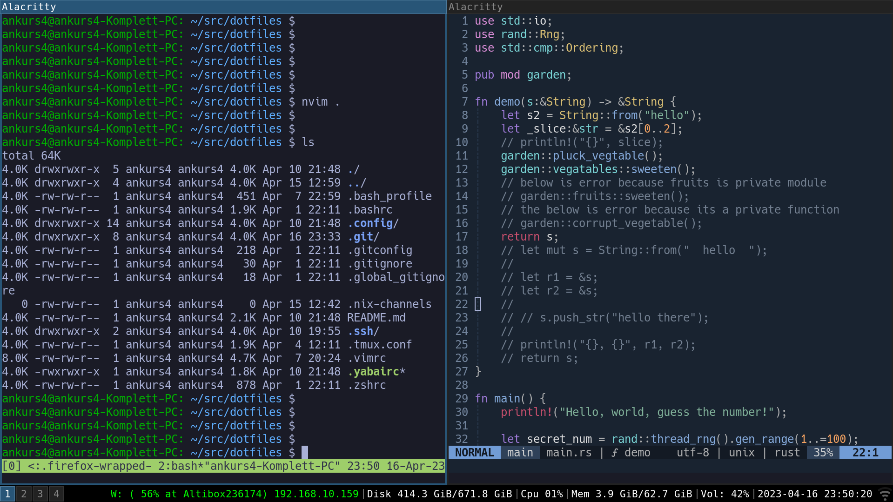

# Dotfiles

My dotfiles for configuration of both linux and macos devices. Includes packages provisioned via nix home-manager. Includes configuration of neovim, i3wm, alacritty, tmux and so on.

## Screenshots



## Usage

Clone into some directory and create softlinks for whatever you need:

```bash
mkdir -p /Users/ankur.sharma/.config
ln -s /Users/ankur.sharma/src/dotfiles/.vimrc /Users/ankur.sharma/.vimrc
ln -s /Users/ankur.sharma/src/dotfiles/.config/nvim /Users/ankur.sharma/.config/nvim
ln -s /Users/ankur.sharma/src/dotfiles/.tmux.conf /Users/ankur.sharma/.tmux.conf
ln -s /Users/ankur.sharma/src/dotfiles/.bashrc /Users/ankur.sharma/.bashrc
ln -s /Users/ankur.sharma/src/dotfiles/.bash_profile /Users/ankur.sharma/.bash_profile
ln -s /Users/ankur.sharma/src/dotfiles/.zshrc /Users/ankur.sharma/.zshrc
ln -s /Users/ankur.sharma/src/dotfiles/.config/nix /Users/ankur.sharma/.config/nix
ln -s /Users/ankur.sharma/src/dotfiles/.config/nixpkgs /Users/ankur.sharma/.config/nixpkgs
ln -s /Users/ankur.sharma/src/dotfiles/.config/home-manager /Users/ankur.sharma/.config/home-manager
ln -s /Users/ankur.sharma/src/dotfiles/.nix-channels /Users/ankur.sharma/.nix-channels
ln -s /Users/ankur.sharma/src/dotfiles/.config/lemonade.toml /Users/ankur.sharma/.config/lemonade.toml
ln -s /Users/ankur.sharma/src/dotfiles/.gitconfig /Users/ankur.sharma/.gitconfig
ln -s /Users/ankur.sharma/src/dotfiles/.global_gitignore /Users/ankur.sharma/.global_gitignore
ln -s /Users/ankur.sharma/src/dotfiles/.config/alacritty /Users/ankur.sharma/.config/alacritty
ln -s /Users/ankur.sharma/src/dotfiles/.config/i3 /Users/ankur.sharma/.config/i3
ln -s /Users/ankur.sharma/src/dotfiles/.config/i3status /Users/ankur.sharma/.config/i3status
ln -s /Users/ankur.sharma/src/dotfiles/.config/rofi /Users/ankur.sharma/.config/rofi
ln -s /Users/ankur.sharma/src/dotfiles/.yabairc /Users/ankur.sharma/.yabairc
ln -s /Users/ankur.sharma/src/dotfiles/.config/skhd /Users/ankur.sharma/.config/skhd
ln -s /Users/ankur.sharma/src/dotfiles/.config/spacebar /Users/ankur.sharma/.config/spacebar
mkdir -p /Users/ankur.sharma/.docker
ln -s /Users/ankur.sharma/src/dotfiles/.docker/config.json /Users/ankur.sharma/.docker/config.json
```

For VsCode:

```bash
# on linux
ln -s /home/ankurs4/src/dotfiles/.config/Code/User/settings.json /home/ankurs4/.config/Code/User/settings.json
ln -s /home/ankurs4/src/dotfiles/.config/Code/User/keybindings.json /home/ankurs4/.config/Code/User/keybindings.json
# on mac
ln -s /Users/ankur.sharma/src/dotfiles/.config/Code/User/settings.json "/Users/ankur.sharma/Library/Application Support/Code/User/settings.json"
ln -s /Users/ankur.sharma/src/dotfiles/.config/Code/User/keybindings.json "/Users/ankur.sharma/Library/Application Support/Code/User/keybindings.json"
```

For home-manager stuff, install nix and run `nix run ~/src/dotfiles/.config/home-manager#homeConfigurations.ankurs4.activationPackage`

## Notes

For running alacritty on linux machine: `nix run --impure github:guibou/nixGL -- alacritty`
